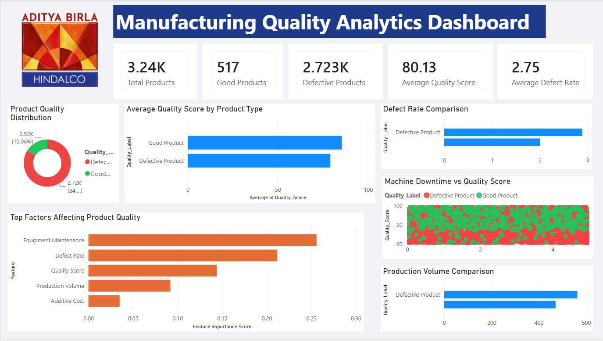

# Product Quality Prediction and Manufacturing Analytics

An end-to-end Manufacturing Analytics project that combines Data Analysis, Machine Learning, Streamlit, and Power BI to identify quality issues, predict product defects, and support data-driven decision-making.

## 🔗Live Application

**Streamlit App:**  
https://ayush-manufacturing-quality-prediction-system.streamlit.app/

---

## Project Overview

Manufacturing defects increase production costs, reduce operational efficiency, and impact customer satisfaction.

This project analyzes manufacturing process data to identify the factors influencing product quality and develops a predictive system capable of classifying products as Good or Defective.

The solution includes:

- Data Cleaning and Validation
- Exploratory Data Analysis (EDA)
- Machine Learning-Based Quality Prediction
- Interactive Streamlit Application
- Power BI Executive Dashboard

---

## Business Objective

The goal of this project is to help manufacturing teams:

- Detect quality issues early
- Understand factors affecting product quality
- Monitor manufacturing KPIs
- Reduce defect rates
- Support data-driven operational decisions

---

## Dashboard Preview




---

## Dataset Information

**Dataset:** Product Quality Manufacturing Analytics Dataset

**Source:** Kaggle

### Dataset Summary

- Total Records: 3,240
- Total Features: 16 Manufacturing Variables
- Target Variable: Product_Quality

### Target Classes

- 0 = Good Product
- 1 = Defective Product

### Dataset Distribution

- Good Products: 517
- Defective Products: 2,723

### Key Features

- Production_Volume
- Production_Cost
- Raw_Material_Quality
- Material_Delivery_Delay
- Defect_Rate
- Quality_Score
- Equipment_Maintenance_Count
- Machine_Downtime_Hours
- Inventory_Turnover
- Stockout_Rate
- Operator_Productivity
- Safety_Incidents
- Energy_Consumption
- Energy_Efficiency
- Process_Additive_Usage
- Additive_Cost

---

## Data Analysis Workflow

### Data Cleaning

- Missing Value Analysis
- Duplicate Record Check
- Data Validation
- Feature Inspection

### Exploratory Data Analysis (EDA)

Analysis performed on:

- Product Quality Distribution
- Quality Score Analysis
- Defect Rate Analysis
- Production Volume Analysis
- Equipment Maintenance Analysis
- Machine Downtime Analysis
- Correlation Analysis

### Key Findings

- Equipment Maintenance Count is the strongest predictor of product quality.
- Higher Defect Rates significantly increase the likelihood of defective products.
- Good products consistently achieve higher Quality Scores.
- Production Volume has a measurable impact on manufacturing performance.
- Preventive maintenance can play a critical role in reducing defects.

---

## Machine Learning

### Models Evaluated

- Logistic Regression
- Random Forest Classifier

### Final Model Selected

**Random Forest Classifier**

### Evaluation Metrics

- Accuracy
- Precision
- Recall
- F1 Score
- ROC-AUC Score
- Confusion Matrix

### Business Outcome

The Random Forest model demonstrated better performance in handling complex feature relationships and class imbalance, making it suitable for manufacturing quality prediction.

---

## Power BI Dashboard

The Power BI dashboard provides executive-level visibility into manufacturing operations.

### Dashboard Features

- Total Products
- Good Products
- Defective Products
- Average Quality Score
- Average Defect Rate
- Product Quality Distribution
- Quality Score Comparison
- Defect Rate Comparison
- Production Volume Comparison
- Machine Downtime Analysis
- Top Factors Affecting Product Quality

### Business Insights

The dashboard helps manufacturing stakeholders:

- Monitor production quality KPIs
- Identify quality bottlenecks
- Compare performance metrics
- Understand drivers of product defects
- Support data-driven quality improvement initiatives

---

## Streamlit Application

The application consists of the following modules:

### Home
Dataset overview and project summary.

### EDA
Interactive exploratory data analysis and visualizations.

### Model Training
Model evaluation metrics, confusion matrix, ROC-AUC analysis, and model comparison.

### Prediction
Real-time product quality prediction using manufacturing process parameters.

### Dashboard Overview
Integrated Power BI dashboard summary.

---

## Technology Stack

| Category | Tools |
|-----------|--------|
| Programming Language | Python |
| Data Analysis | Pandas, NumPy |
| Data Visualization | Matplotlib, Seaborn |
| Machine Learning | Scikit-Learn |
| Dashboarding | Power BI |
| Web Application | Streamlit |
| Development Environment | Jupyter Notebook |

---

## Project Structure

```text
product-quality-prediction-manufacturing-analytics/

├── assets/
│   └── Manufacturing_Dashboard.png
│
├── dataset/
│   ├── product_quality_manufacturing_analytics.csv
│   └── feature_importance.xlsx
│
├── manufacturing_project.ipynb
├── app.py
├── requirements.txt
├── README.md
└── .gitignore
```

## Installation and Setup

### 1. Clone the Repository

```bash
git clone https://github.com/onseventhflow/product-quality-prediction-manufacturing-analytics.git

cd product-quality-prediction-manufacturing-analytics
```

### 2. Install Dependencies

```bash
pip install -r requirements.txt
```

### 3. Run the Application

```bash
python -m streamlit run app.py
```

### 4. Open in Browser

```text
http://localhost:8501
```

---

## Project Deliverables

- Manufacturing Data Analysis
- Exploratory Data Analysis Report
- Machine Learning Model
- Product Quality Prediction System
- Power BI Executive Dashboard
- Interactive Streamlit Application

---

## Business Impact

This project demonstrates how data analytics and machine learning can be applied in manufacturing environments to:

- Improve product quality
- Reduce production defects
- Support predictive quality monitoring
- Enable data-driven decision-making
- Enhance operational efficiency
- Reduce quality-related operational costs

---

## Future Improvements

- XGBoost model integration
- Automated dashboard refresh
- Hyperparameter tuning for improved model performance
- Real-time manufacturing data pipeline

---

Ayush Kumar Chaubey
